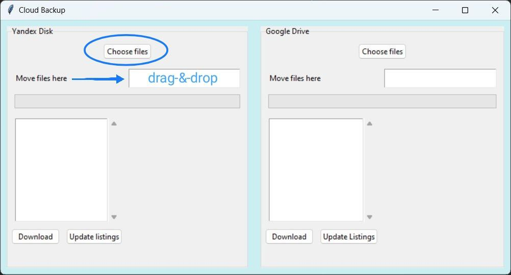

# Cloud Backup
__Backup to Google Drive &amp; Яндекс.Диск__

Добро пожаловать в Cloud Backup! Это интерфейс на основе GUI, который позволяет без необходимости, не заходя в браузер;
* Отправлять файлы в Google Drive и Яндекс.Диск.
* Просматривать список уже загруженных файлов.
* Скачивать файлы обратно на локальный диск.

## Быстрый старт

1. **Login**
   * Нажмите кнопку **Login** в выбранном блоке (Яндекс.Диск или Google Drive). 
   * После успешной авторизации кнопка автоматически изменится на **Choose files**. 
   * Поддерживается drag-&-drop, просто перетащите файлы в специальную зону.

   

2. **Загрузка файлов**
   * Нажмите **Choose files** и выберите файлы через диалог, либо используйте drag-&-drop. 
   * Файлы упаковываются в ZIP и отправляются в папку ```Backup``` вашего облачного хранилища. 
   * Прогресс отображается полосой загрузки.

3. **Просмотр списка файлов**
   * Нажмите **Update listings** под списком файлов. 
   * Если папка ```Backup``` отсутствует, появится сообщение ```No files found in Backup```. 
   * Если файлы есть, вы увидите их имена в списке.

   

4. **Скачивание файлов**
   * Выберите нужный файл в списке. 
   * Нажмите **Download**, выберите локальную папку и нажмите OK. 
   * Файл будет сохранён, а прогресс скачивания отобразится полосой.
